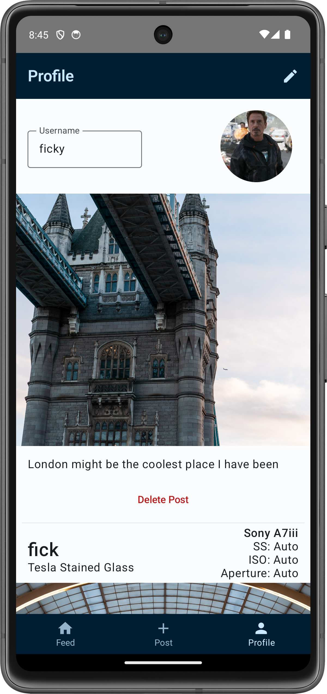

# PixelPulse

## Description
PixelPulse is a photography-focused social platform, similar to platforms like Instagram and Twitter, but more focused on the creative and artistic niches of photography from both platforms.

## Implementation
The app leverages Firebase for user authentication and storage of posts. The app also leverages content receivers for uploading images and implicit intents for searching locations in maps.

## Usage
To run, simply press play on the emulator in Android Studio, and have fun!

## Example Screens

  

   

   

